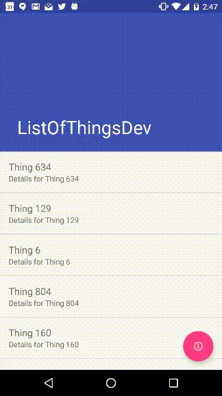

# ListOfThings app
This app is a contrived example to illustrate some best practices for Android architecture. It displays a list of things retrieved from an external source and cached to locally to disk.The external source implementation is currently just a mock object (see MockThingService), but could easily be connected to real sources using a retrofit implementation of ThingService.

 
## The app demonstrates the following:
1. [Uncle Bob's Clean Artchitecture](https://blog.8thlight.com/uncle-bob/2012/08/13/the-clean-architecture.html)
2. Separate app, core, and data modules to enforce independent layers 
2. Dev and Prod product flavors to keep essential non-production code out of production builds. 
3. Dagger 2 for dependency injection
4. RxJava for asynchronous data operations
5. Shelf for basic object disk caching
6. Retrofit for web service integration
7. Junit and Mockito for unit tests
8. Retrolambda for Java 8 lambda support
2. Example Interactors to isolate business use cases
2. Example Repository and DataSource to demonstrate separation of caching, entity mapping, and external source integration
2. Injectable Mock DataSource (MockThingService)
9. Activities with custom Views _instead of Fragments_.  [Based on this.](https://corner.squareup.com/2014/10/advocating-against-android-fragments.html) 
10. BasePresenter to separate presentation work from Views (e.g. manage view-related Rx subscriptions)
10. AppCompat Toolbar (replaces ActionBar)
11. CoordinatorLayout scroll behavior with quick-return toolbar
12. RecyclerView implementation
13. LeakCanary
14. Retrofit ServiceFactory
15. Rx Scheduler injection
16. Mocked delay (2 seconds) for Thing Service to demonstrate UI progress feedback
17. Switchable Environments
18. Git build integration
19. Global error handling

License
-------

    Copyright 2015 Todd Way

    Licensed under the Apache License, Version 2.0 (the "License");
    you may not use this file except in compliance with the License.
    You may obtain a copy of the License at

       http://www.apache.org/licenses/LICENSE-2.0

    Unless required by applicable law or agreed to in writing, software
    distributed under the License is distributed on an "AS IS" BASIS,
    WITHOUT WARRANTIES OR CONDITIONS OF ANY KIND, either express or implied.
    See the License for the specific language governing permissions and
    limitations under the License.

